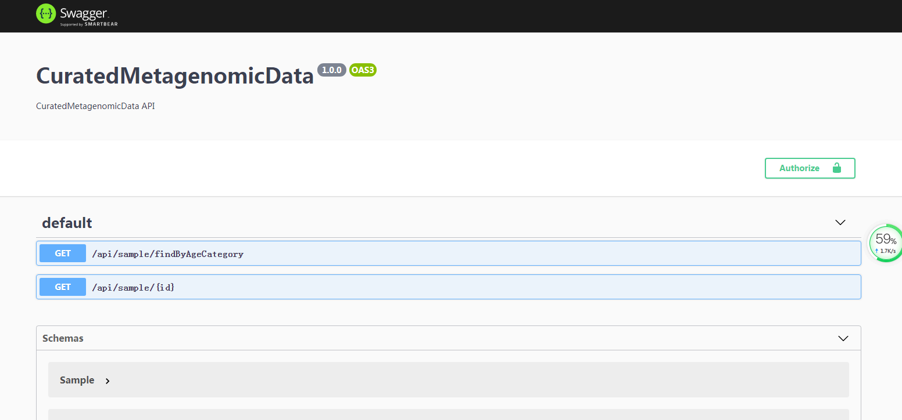

# 开始阅读此前的代码

我主要关心的目前还不是目标系统是如何实现的，而是关心的目标系统的功能到底是什么？

明白了功能才能考虑实现问题。

# 使用的代码仓库为

```bash
https://github.com/QuanWan89/cmgd_wrapup
```

## 账号

这是一个开放仓库，git clone的时候根本不需要任何账号。

## 命令及进度

```bash
time git clone https://github.com/QuanWan89/cmgd_wrapup.git .
Cloning into '.'...
remote: Enumerating objects: 4331, done.
remote: Counting objects: 100% (4331/4331), done.
remote: Compressing objects: 100% (3233/3233), done.
remote: Total 4331 (delta 934), reused 4331 (delta 934), pack-reused 0
Receiving objects: 100% (4331/4331), 4.56 MiB | 10.00 KiB/s, done.
Resolving deltas: 100% (934/934), done.
Updating files: 100% (4179/4179), done.

real    7m49.118s
user    0m0.000s
sys     0m0.015s
```

从国外的github克隆过来，竟然花了将近8分钟。

网络条件并不是太顺。

# 先从node-api开始阅读代码

## 执行index.js

### 错误提示如下

```bash
D:\node\node.exe E:\t\t9\cmgd_wrapup\node-api\index.js
internal/modules/cjs/loader.js:818
  throw err;
  ^

Error: Cannot find module 'express'
Require stack:
- E:\t\t9\cmgd_wrapup\node-api\index.js
    at Function.Module._resolveFilename (internal/modules/cjs/loader.js:815:15)
    at Function.Module._load (internal/modules/cjs/loader.js:667:27)
    at Module.require (internal/modules/cjs/loader.js:887:19)
    at require (internal/modules/cjs/helpers.js:74:18)
    at Object.<anonymous> (E:\t\t9\cmgd_wrapup\node-api\index.js:1:17)
    at Module._compile (internal/modules/cjs/loader.js:999:30)
    at Object.Module._extensions..js (internal/modules/cjs/loader.js:1027:10)
    at Module.load (internal/modules/cjs/loader.js:863:32)
    at Function.Module._load (internal/modules/cjs/loader.js:708:14)
    at Function.executeUserEntryPoint [as runMain] (internal/modules/run_main.js:60:12) {
  code: 'MODULE_NOT_FOUND',
  requireStack: [ 'E:\\t\\t9\\cmgd_wrapup\\node-api\\index.js' ]
}

Process finished with exit code 1

```

### 错误的原因

需要的库根本就没有安装。

### 解决办法

```bash
D:\node\node.exe D:\node\node_modules\npm\bin\npm-cli.js install --scripts-prepend-node-path=auto
```

以上代码的解释：

根据文件`package.json`中的内容，自动安装其中描述的，需要用到的包。

### 以上命令的输出

```bash
> deasync@0.1.20 install E:\t\t9\cmgd_wrapup\node-api\node_modules\deasync
> node ./build.js

`win32-x64-node-12` exists; testing
Binary is fine; exiting

> nodemon@2.0.4 postinstall E:\t\t9\cmgd_wrapup\node-api\node_modules\nodemon
> node bin/postinstall || exit 0

npm WARN node-api@1.0.0 No description
npm WARN node-api@1.0.0 No repository field.
npm WARN optional SKIPPING OPTIONAL DEPENDENCY: fsevents@2.1.3 (node_modules\fsevents):
npm WARN notsup SKIPPING OPTIONAL DEPENDENCY: Unsupported platform for fsevents@2.1.3: wanted {"os":"darwin","arch":"any"} (current: {"os":"win32","arch":"x64"})

added 251 packages from 175 contributors in 41.014s

9 packages are looking for funding
  run `npm fund` for details


Process finished with exit code 0

```

貌似顺利。

## 再次执行index.js

成功启动。

### 使用浏览器访问80端口(http://127.0.0.1/)

得到结果为：

```bash
{"message":"not found","errors":[{"path":"/","message":"not found"}]}
```

### 分析

以上结果应该属于预期，我们访问的路径部分应该不是`/`才对。

### 分析index.js中的use部分

```javascript
app.use("/api-docs", swaggerUi.serve, swaggerUi.setup(swaggerSpec));
app.use("/test", require("./routes/api/test"));
app.use("/api/taxonomy", require("./routes/api/taxonomy"));
app.use("/api/sample", require("./routes/api/sample"));
```

接下来分别使用以上4个路径进行测试

## 测试1(http://127.0.0.1/test)

### 得到结果

```bash
{"message":"connect ECONNREFUSED 127.0.0.1:5432"}
```

### 结果分析

5432这个貌似数据库服务器的端口号，我们还没有安装呢。

若因此被拒，也在情理之中。

## 测试1(http://127.0.0.1/api-docs)


### 结果



### 结果分析

这是一个由swagger提供的UI啊。

既然swagger是web service framework，那么这个ui肯定就是提供给web service的使用者的。

让使用者可以方便的调试我们通过web service这种形式暴露的东东。

暴露出去的东东很可能是方法，暂时不细究。

## 测试(/api/taxonomy和/api/sample)

这个暂时不用测试了。

数据库服务器都没有安装一定不会好使。

明天考虑安装个数据库服务器试试。