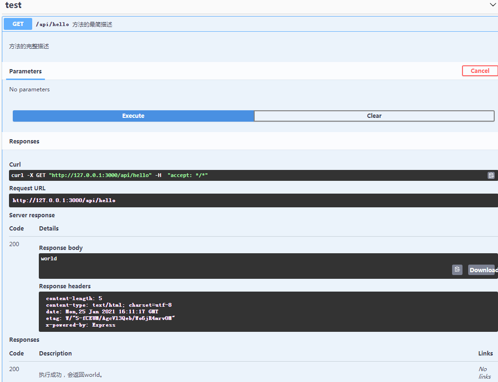

具体的API都使用注释的形式进行描述，这样要方便很多。

# 修改这组api的使用代码,增加可读性

首先，我们把这一组API都放入到此前生成的路由序偶中，所以`index.ts`中的序偶使用代码修改了一下路径(增加了api三个字母)，增加了可读性。

修改之后，代码如下：

```typescript
app.use('/api', router);
```

# 实现这一组api中的第1个

## 功能是

输入是hello，产生world。

## 代码如下

```typescript
//中间部分：才是路由自己的个性化部分
router.get('/hello', function (req, res) {
    res.send('world');
});
```

## 在以上代码的前面加上swagger风格的注释

解释如下：

### 注释标志(注意:1个空格)

```typescript
 * @swagger
```

### 访问这个api使用的路径(注意:1个空格和后面的冒号)

```
 * /api/hello:
```

### 访问这个api使用的方法(注意:3个空格和后面的冒号)

3个空格是因为前面是冒号，所以需要再次缩进两个空格。

```typescript
 *   get:
```

### 给api加标签便于使用标签对api进行分组(注意缩进和标签分隔符)

```typescript
 *     tags:
 *       - test
```

### 对这个方法的最简描述(注意：5个空格)

```typescript
 *     summary: 方法的最简描述
```

### 对这个方法的完整描述(注意：5个空格)

```typescript
 *     description: 方法的完整描述
```

### 对响应的描述

```typescript
 *     responses:
 *       "200":
 *         description: 执行成功，会返回world。
```


### 最终完整注释api

```typescript
/**
 * @swagger
 * /api/hello:
 *   get:
 *     tags:
 *       - test
 *     summary: 方法的最简描述
 *     description: 方法的完整描述
 *     responses:
 *       "200":
 *         description: 执行成功，会返回world。
 */
router.get('/hello', function (req, res) {
    res.send('world');
});
```

## 效果


